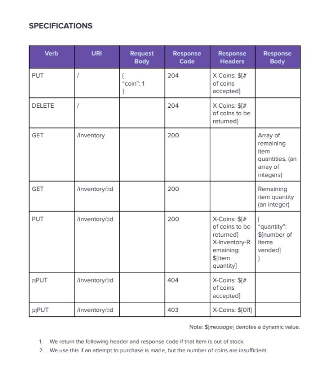

# Vend-O-Matic
### A beverage vending machine service using Python

[Setup](#setup)

[Testing](#testing)

[Project Requirements](#project-requirements)

[Design Decisions](#design-decisions)

## Setup

### OSX/Linux 
Inside your terminal please install XCode Command Line Tools and Python if you have not already done so
``` brew install python ```
``` xcode-select --install ```

Then while inside of the repo run:

```make all```

### Windows
For Windows please ensure you have git and Python installed locally
https://www.python.org/downloads/

https://git-scm.com/install/windows

To start the API, in your git bash run(inside of the cloned repository) 

```make all ```

## Testing

The above ``` make all ``` command will run unit tests, and start the api. However, if you want to run integration tests assuming you have ran the above command you can run:

```make integration``` or ```make test``` to run the unit tests individually


## Project Requirements
1. The machine only accepts US quarters - you physically cannot put anything else in, and
you can only put one coin in at a time.
2. Purchase price of an item is two US quarters.
3. Machine only holds five of each of the three beverages available to purchase in its
inventory.
4. Machine will accept more than the purchase price of coins, but will only dispense a single
beverage per transaction.
5. Upon transaction completion, any unused quarters must be dispensed back to the
customer.
6. All test interactions will be performed with a single content type of “application/json”.


## Design Decisions
For this project, I focused on separation of concerns, object-oriented design, and test-driven development.

The core vending machine behavior is implemented in a standalone class that contains all business logic, including coin validation, inventory checks, and transaction handling.

Error handling is implemented using three explicit domain exceptions, which are bubbled up and handled at the REST layer.

Only two external packages were added:

requests — used for integration tests that verify route behavior

Flask — used as an HTTP layer to expose functionality via REST routes

An in-memory JSON structure is used as a simple storage layer to represent inventory and pricing.

